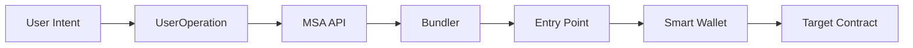

# Introduction to Account Abstraction

Account Abstraction (AA) represents a paradigm shift in how wallets work on Ethereum and EVM-compatible blockchains. Instead of relying solely on Externally Owned Accounts (EOAs) controlled by private keys, Account Abstraction enables programmable smart contract wallets with customizable validation logic.

## What is Account Abstraction?

Traditional Ethereum accounts have limitations:
- **Single signature requirement**: Only one private key controls the account
- **Fixed gas payment**: Only ETH can be used to pay for gas
- **Limited recovery options**: Lose your private key, lose your wallet
- **Poor UX**: Complex transaction signing flow

Account Abstraction solves these problems by making wallets programmable smart contracts that can:
- Use multiple signature schemes (ECDSA, passkeys, multi-sig)
- Pay gas with any ERC-20 token via paymasters
- Implement custom recovery mechanisms
- Batch multiple operations into a single transaction
- Provide familiar Web2-like user experiences

## How MSA API Works

The MSA API abstracts the complexity of Account Abstraction, providing developers with simple REST endpoints to:

### 1. Create Wallets
Deploy smart contract wallets with various custody options:

```typescript
// Create a passkey-enabled wallet
const wallet = await msaClient.createWallet({
  walletCustody: CustodyType.ECDSA_PASSKEY_VALIDATOR,
  salt: "user@example.com",
  passkeyPubKey: ["base64-encoded-key"]
});
```

### 2. Execute Transactions
Send UserOperations through the Entry Point contract:

```typescript
// Execute a token transfer
const result = await msaClient.execute({
  operations: [{
    salt: "user@example.com",
    to: "0x...", // Token contract
    funcSignature: "transfer(address,uint256)",
    funcParams: ["0x...", "1000000000000000000"] // 1 token
  }]
});
```

### 3. Manage Security
Configure validators, signers, and recovery mechanisms:

```typescript
// Add a new signer to a multisig wallet
const result = await msaClient.addSigner({
  to: walletAddress,
  funcSignature: "addSigner(address,(bool,bool,bool,bool))",
  funcParams: [
    newSignerAddress,
    [true, true, true, true] // Permissions
  ]
});
```

## Key Concepts

### Custody Types

MSA API supports five custody configurations:

#### 1. ECDSA_VALIDATOR (Traditional)
- Standard ECDSA signature validation
- Similar to traditional wallets
- Good for simple use cases

#### 2. ECDSA_PASSKEY_VALIDATOR (Hybrid)
- Combines ECDSA signatures with passkey authentication
- Enhanced security through biometric verification
- Ideal for consumer applications

#### 3. PASSKEY_VALIDATOR (Biometric)
- Pure passkey-based authentication
- No private keys to manage
- Perfect for Web2-native experiences

#### 4. MULTISIG_VALIDATOR (Shared Control)
- Traditional M-of-N multi-signature setup
- Shared custody between multiple parties
- Essential for organizational use

#### 5. MULTISIG_PASSKEY_VALIDATOR (Enterprise)
- Multi-signature with passkey support
- Maximum security for high-value scenarios
- Combines shared control with biometric auth

### Entry Points and UserOperations

Account Abstraction uses a standardized flow:

1. **UserOperation**: A structure containing transaction intent
2. **Entry Point**: Smart contract that validates and executes UserOperations
3. **Bundler**: Service that submits UserOperations to the Entry Point
4. **Paymaster**: Optional contract that sponsors gas payments



### Gas Management

MSA API handles gas optimization automatically:

- **Gas Estimation**: Predicts gas costs before execution
- **Gas Overshoot**: Configurable buffer to prevent failures
- **Paymaster Integration**: Support for sponsored transactions
- **Multi-chain**: Optimized for different network conditions

### Security Features

#### HSM/MPC Integration
- Hardware Security Module support
- Multi-Party Computation signing
- Enterprise-grade key management
- Fireblocks integration

#### Validation Layers
- Custom signature validation logic
- Time-based restrictions
- Spending limits
- Recovery mechanisms

#### Audit Trail
- Complete transaction history
- Signature verification logs
- Gas usage analytics
- Error tracking

## Benefits for Developers

### Simplified Integration
- RESTful API design
- Comprehensive SDKs
- Type-safe interfaces
- Extensive documentation

### Multi-Language Support
- TypeScript/JavaScript SDK
- Python client library
- cURL examples
- OpenAPI specification

### Testing & Development
- Testnet support
- Sandbox environments
- Transaction simulation
- Gas estimation tools

### Enterprise Ready
- High availability infrastructure
- Rate limiting and quotas
- Monitoring and alerting
- SLA guarantees

## Use Cases

### Consumer Applications
- Passwordless wallet onboarding
- Biometric transaction signing
- Gas-sponsored user experiences
- Social recovery mechanisms

### Enterprise Solutions
- Multi-signature treasury management
- Automated payment processing
- Compliance-friendly workflows
- Integration with existing systems

### DeFi Integration
- Smart contract wallet compatibility
- Token approvals and transfers
- Liquidity pool interactions
- Yield farming automation

### Gaming & NFTs
- In-game asset management
- Gasless microtransactions
- Batch NFT operations
- Player-owned economies

## Next Steps

Now that you understand the fundamentals, you're ready to:

1. **[Set up Authentication](/docs/getting-started/authentication)** - Configure your API credentials
2. **[Quick Start Guide](/docs/getting-started/quick-start)** - Create your first wallet
3. **[Explore Wallet Management](/docs/wallet-management/creating-wallets)** - Learn advanced wallet features

---

<div className="mt-8 p-4 bg-yellow-50 rounded-lg">
  <p className="text-yellow-800">
    <strong>🔍 Deep Dive:</strong> Want to learn more about Account Abstraction? Check out <a href="https://eips.ethereum.org/EIPS/eip-4337" className="underline">EIP-4337</a> for the technical specification.
  </p>
</div> 