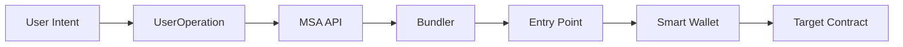

Account Abstraction (AA) representa uma mudança de paradigma em como as carteiras funcionam no Ethereum e blockchains compatíveis com EVM. Em vez de depender apenas de Externally Owned Accounts (EOAs) controladas por chaves privadas, Account Abstraction possibilita carteiras de smart contract programáveis com lógica de validação personalizável.

## O que é Account Abstraction?

As contas tradicionais do Ethereum têm limitações:
- **Requisito de assinatura única**: Apenas uma chave privada controla a conta
- **Pagamento de gas fixo**: Apenas ETH pode ser usado para pagar gas
- **Opções de recuperação limitadas**: Perca sua chave privada, perca sua carteira
- **UX ruim**: Fluxo complexo de assinatura de transações

Account Abstraction resolve esses problemas tornando as carteiras smart contracts programáveis que podem:
- Usar múltiplos esquemas de assinatura (ECDSA, passkeys, multi-sig)
- Pagar gas com qualquer token ERC-20 via paymasters
- Implementar mecanismos de recuperação personalizados
- Agrupar múltiplas operações em uma única transação
- Fornecer experiências de usuário familiares similares ao Web2

## Como a API MSA Funciona

A API MSA abstrai a complexidade do Account Abstraction, fornecendo aos desenvolvedores endpoints REST simples para:

### 1. Criar Carteiras
Implante carteiras de smart contract com várias opções de custody:

```typescript
// Usando API HTTP (fetch) para criação de carteira
const response = await fetch('https://api.msa.omnes.tech/create', {
  method: 'POST',
  headers: { 'Content-Type': 'application/json' },
  body: JSON.stringify({
    accounts: [{
      walletCustody: 3, // ECDSA_PASSKEY_VALIDATOR
      salt: "user@example.com",
      passkeyPubKey: ["base64-encoded-key"]
    }],
    settings: { /* ... */ }
  })
});
const wallet = await response.json();
```

### 2. Executar Transações
Envie UserOperations através do contrato Entry Point:

```typescript
// Usando SmartWallet SDK para execução de transações
import { PKSigner, SmartWallet, AccountOperations, Operation } from '@omnes/smartwallet-ts-sdk';

const signer = await PKSigner.create(privateKey as `0x${string}`);
const smartWallet = await SmartWallet.create(
    signer.signMessage,
    signer.signMessage,
    signer.getEVMAddress(),
    rpcURL,
    apiKey
);

const operations: Operation = {
    to: "0x...", // Contrato de token
    value: BigInt(0),
    funcSignature: "transfer(address,uint256)",
    params: ["0x...", 1000000000000000000] // 1 token
};

const accountOperations: AccountOperations[] = [{
    account: {
        walletCustody: 1,
        salt: "user@example.com",
        publicKeys: []
    },
    operations: [operations],
    settings: {}
}];

const result = await smartWallet.buildAndRequestSendUserOperations(
    accountOperations,
    [],
    []
);
```

### 3. Gerenciar Segurança
Configure validadores, signatários e mecanismos de recuperação:

```typescript
// Adicionar um novo signatário a uma carteira multisig
const result = await msaClient.addSigner({
  to: walletAddress,
  funcSignature: "addSigner(address,(bool,bool,bool,bool))",
  funcParams: [
    newSignerAddress,
    [true, true, true, true] // Permissões
  ]
});
```

## Conceitos Principais

### Tipos de Custody

A API MSA suporta cinco configurações de custody:

#### 1. ECDSA_VALIDATOR (Tradicional)
- Validação de assinatura ECDSA padrão
- Similar a carteiras tradicionais
- Bom para casos de uso simples

#### 2. ECDSA_PASSKEY_VALIDATOR (Híbrido)
- Combina assinaturas ECDSA com autenticação passkey
- Segurança aprimorada através de verificação biométrica
- Ideal para aplicações de consumo

#### 3. PASSKEY_VALIDATOR (Biométrico)
- Autenticação baseada apenas em passkey
- Nenhuma chave privada para gerenciar
- Perfeito para experiências nativas Web2

#### 4. MULTISIG_VALIDATOR (Controle Compartilhado)
- Configuração tradicional de multi-assinatura M-of-N
- Custody compartilhada entre múltiplas partes
- Essencial para uso organizacional

#### 5. MULTISIG_PASSKEY_VALIDATOR (Empresarial)
- Multi-assinatura com suporte a passkey
- Segurança máxima para cenários de alto valor
- Combina controle compartilhado com autenticação biométrica

### Entry Points e UserOperations

Account Abstraction usa um fluxo padronizado:

1. **UserOperation**: Uma estrutura contendo intenção de transação
2. **Entry Point**: Smart contract que valida e executa UserOperations
3. **Bundler**: Serviço que envia UserOperations para o Entry Point
4. **Paymaster**: Contrato opcional que patrocina pagamentos de gas



### Gerenciamento de Gas

A API MSA gerencia otimização de gas automaticamente:

- **Estimativa de Gas**: Prevê custos de gas antes da execução
- **Gas Overshoot**: Buffer configurável para prevenir falhas
- **Integração Paymaster**: Suporte para transações patrocinadas
- **Multi-chain**: Otimizado para diferentes condições de rede

### Recursos de Segurança

#### Integração HSM/MPC
- Suporte a Hardware Security Module
- Assinatura Multi-Party Computation
- Gerenciamento de chaves de nível empresarial
- Integração Fireblocks

#### Camadas de Validação
- Lógica de validação de assinatura personalizada
- Restrições baseadas em tempo
- Limites de gastos
- Mecanismos de recuperação

#### Trilha de Auditoria
- Histórico completo de transações
- Logs de verificação de assinatura
- Análise de uso de gas
- Rastreamento de erros

## Benefícios para Desenvolvedores

### Integração Simplificada
- Design de API RESTful
- SDK TypeScript com segurança de tipos completa
- Exemplos HTTP para outras linguagens
- Documentação extensiva

### Suporte Multi-Linguagem
- **SDK TypeScript**: SDK completo (`@omnes/smartwallet-ts-sdk`)
- **Exemplos HTTP**: JavaScript (fetch), Python (requests), cURL
- **Especificação OpenAPI**: Para integrações personalizadas

### Testes e Desenvolvimento
- Suporte a testnet
- Ambientes sandbox
- Simulação de transações
- Ferramentas de estimativa de gas

### Pronto para Empresas
- Infraestrutura de alta disponibilidade
- Limitação de taxa e cotas
- Monitoramento e alertas
- Garantias de SLA

## Casos de Uso

### Aplicações de Consumo
- Onboarding de carteira sem senha
- Assinatura de transações biométricas
- Experiências de usuário com gas patrocinado
- Mecanismos de recuperação social

### Soluções Empresariais
- Gerenciamento de tesouraria multi-assinatura
- Processamento de pagamentos automatizado
- Fluxos de trabalho compatíveis com conformidade
- Integração com sistemas existentes

### Integração DeFi
- Compatibilidade com carteira de smart contract
- Aprovações e transferências de tokens
- Interações com pools de liquidez
- Automação de yield farming

### Jogos e NFTs
- Gerenciamento de ativos no jogo
- Microtransações sem gas
- Operações em lote de NFTs
- Economias de propriedade do jogador

## Próximos Passos

Agora que você entende os fundamentos, está pronto para:

1. **[Configurar Autenticação](/docs/getting-started/authentication)** - Configure suas credenciais da API
2. **[Guia de Início Rápido](/docs/getting-started/quick-start)** - Crie sua primeira carteira
3. **[Explorar Gerenciamento de Carteiras](/docs/wallet-management/creating-wallets)** - Aprenda recursos avançados de carteira

---

<div className="mt-8 p-4 bg-yellow-50 dark:bg-yellow-900/20 rounded-lg border border-yellow-200 dark:border-yellow-800">
  <div className="text-yellow-800 dark:text-yellow-200">
    <strong className="text-yellow-900 dark:text-yellow-100">🔍 Mergulho Profundo:</strong> Quer aprender mais sobre Account Abstraction? Confira <a href="https://eips.ethereum.org/EIPS/eip-4337" className="underline text-yellow-700 dark:text-yellow-300 hover:text-yellow-800 dark:hover:text-yellow-200">EIP-4337</a> para a especificação técnica.
  </div>
</div> 